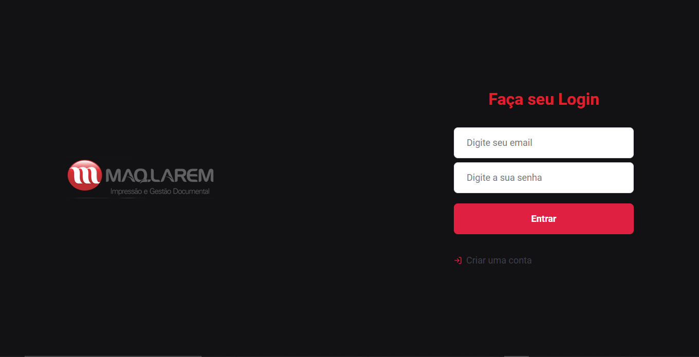
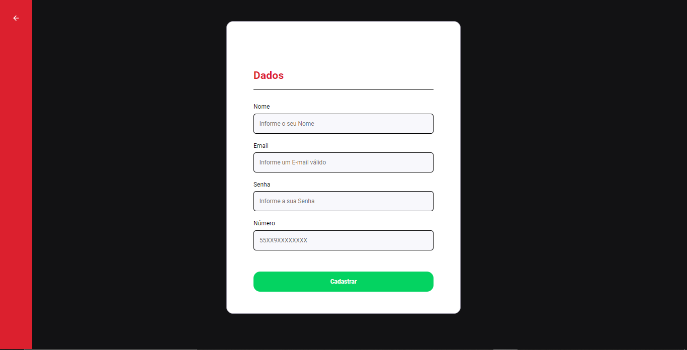
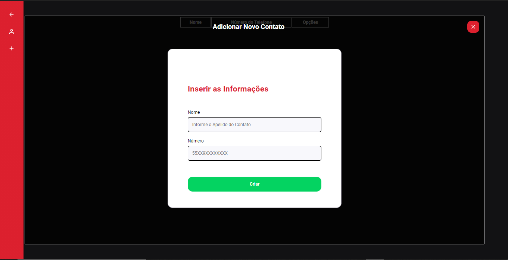

## PROVA TÉCNICA DA MAQ-LAREM

Após realizar o pull do repositório, entrar em cada pasta (web e backend) para realizar um yarn install ou npm install para adiconar as depências do projeto
Na página do backend, necessário dar o comando yarn typeorm migration:run

O projeto buscou criar um sistema de agenda, onde foi utilizado o framework ReactJS no frontend e NodeJS no backend com APIREST e uso de TypeORM

________

<h2 align="center"> 📷 Agenda Telefônica - Login </h2>

________

<h2 align="center"> 📷 Agenda Telefônica - Criar conta </h2>

________

<h2 align="center"> 📷 Agenda Telefônica - Criar contato & Menu </h2>

